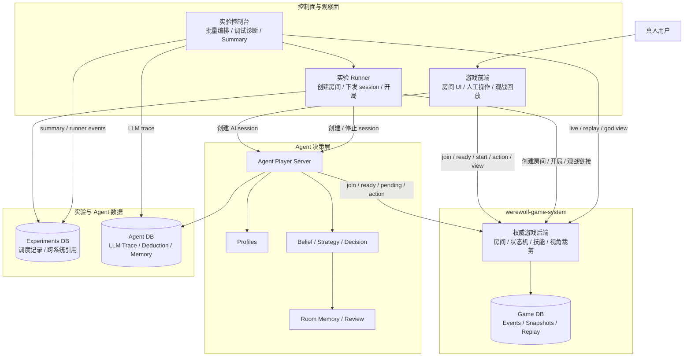

<p align="center">
  
</p>

# Werewolf-AI

Werewolf-AI 是一套面向 AI Agent 对抗、协作与自进化研究的狼人杀系统。项目包含权威游戏引擎、游戏前端、Profile-driven Agent Player Server、批量实验控制台、观战回放和实验分析链路，可以从单局调试扩展到多房间、多局、多 Agent 变体的对照实验。

系统设计重点包括不完全信息下的上下文隔离、角色技能调度、多 Agent 协调、可复盘决策、跨局策略记忆与实验可复现性。

## 核心架构

项目的核心思想是：游戏系统只维护房间和对局事实，不关心玩家背后的控制器是真人、脚本还是 LLM Agent。真人通过游戏前端参与游戏，Agent 通过 Agent Player Server 参与游戏；游戏前端和实验控制台都属于上层控制面，区别在于前者承载 UI 交互与单房间体验，后者承载批量实验、调度恢复和调试分析。



关键边界：

- **游戏系统是唯一局内事实源**：房间、规则状态机、角色技能、视角裁剪、事件、快照、动作链路和 replay 都以游戏后端为准。
- **控制器无差别接入**：真人前端、Agent 服务和实验 runner 都通过同一套 room、ready、pending action、action submit 协议协作。
- **游戏前端与实验控制台同属控制面**：游戏前端提供 UI 交互、单房间操作和观战回放；实验控制台提供批量对照、失败恢复、summary 和 trace。
- **Agent 服务只负责玩家决策**：Agent 自己加入房间、轮询 pending action、调用模型、提交动作和局后复盘；实验平台不代理局内行动。
- **实验平台只保存编排事实**：实验库保存配置、房间/对局映射和 runner events；局内事实回到游戏系统读，认知/记忆事实回到 Agent 库读。

## 系统组成

| 模块 | 职责 | 默认端口 |
| --- | --- | --- |
| [werewolf-game-system](./werewolf-game-system/) | 权威游戏后端与游戏前端：房间、规则状态机、角色技能、信息隔离、事件、持久化、观战和回放 | 后端 `8000`，前端 `5173` |
| [werewolf-agent](./werewolf-agent/) | Agent Player Server：session loop、profile、belief、strategy、decision、postgame review、LLM 审计和策略记忆 | `9001` |
| [werewolf-experiments](./werewolf-experiments/) | 实验控制台：批量房间编排、Agent session 通知、进度展示、错误诊断、观战/回放入口和实验 summary | 后端 `8100`，前端 `5174` |

## 设计要点

- 游戏后端集中维护 6/8/10/12 人狼人杀规则、角色技能、阶段状态机、事件、快照和胜负结算。
- 真人、AI 补位和实验 Agent 都以普通玩家身份接入房间，通过同一套 pending action 和 action submit 协议行动。
- 公共、玩家、上帝视角由服务端裁剪；夜间私有行动、狼人信息、查验结果、女巫药品和 raw output 不依赖前端隐藏。
- Agent 变体通过 profile 表达，baseline、belief decision、static strategy、self-evolve 等配置可以在同一 runtime 中运行。
- belief、strategy selection、decision、repair、fallback、postgame review 和 LLM call 都有结构化记录，便于复盘和指标分析。
- 自进化 Agent 基于 `agent_identity_id` 写入 room-scoped strategy memory，并在后续对局中按 role、phase 和 score 召回。
- 实验平台通过 `public_name_pool` 重排公开玩家名，同时保留 Agent 私有身份，避免公开名长期绑定模型、阵营或实验组。
- 实验控制台负责多房间并行、多局串行、固定角色、失败恢复、summary、LLM trace 与 live/replay 入口。

## 快速开始

### Docker 全栈

```bash
cp docker/.env.example .env
# 编辑 .env，至少填入当前 profile 用到的 LLM API Key
docker compose --env-file .env up -d --build
```

访问入口：

| 入口 | 地址 | 用途 |
| --- | --- | --- |
| 游戏前端 | http://127.0.0.1:8080 | 创建房间、手动调试、观战 |
| 实验控制台 | http://127.0.0.1:5174 | 批量 AI 对局、实验调度、回放和 summary |

Docker 模式包含 PostgreSQL、游戏系统、Agent 服务和实验平台。实验模板见 [docker/experiment-smoke.json](./docker/experiment-smoke.json)。

### 开发模式

环境要求：

- Python 3.11+
- Node.js 20+
- 可选 PostgreSQL
- 真实 Agent 对局需要 LLM API Key

初始化各子模块 `.env`：

```powershell
powershell -ExecutionPolicy Bypass -File scripts\setup-env.ps1
```

或：

```bash
bash scripts/setup-env.sh
```

启动全部服务：

| 平台 | 启动 | 停止 | 状态 |
| --- | --- | --- | --- |
| Windows | `scripts\start-all.ps1` | `scripts\stop-all.ps1` | `scripts\status.ps1` |
| macOS / Linux | `bash scripts/start-all.sh` | `bash scripts/stop-all.sh` | `bash scripts/status.sh` |

开发模式访问：

| 入口 | 地址 |
| --- | --- |
| 游戏前端 | http://127.0.0.1:5173 |
| 实验控制台 | http://127.0.0.1:5174 |

更完整的启动、配置与排查步骤见 [docs/quickstart.md](./docs/quickstart.md)、[docs/deployment.md](./docs/deployment.md) 和 [docs/configuration.md](./docs/configuration.md)。

## 项目综合报告（GitHub Pages）

面向访客与答辩的叙事型综合报告（思路、成果、实验结论）见 [docs/report/](docs/report/index.html)。推送到 GitHub 并在 Settings → Pages 选择 **`/docs`** 分支文件夹后，可访问 `https://<org>.github.io/werewolf-ai/report/`。

## 文档索引

| 文档 | 说明 |
| --- | --- |
| [docs/architecture.md](./docs/architecture.md) | 总体架构、数据边界和典型数据流 |
| [docs/quickstart.md](./docs/quickstart.md) | 本地快速启动 |
| [docs/deployment.md](./docs/deployment.md) | Docker 与开发部署 |
| [docs/configuration.md](./docs/configuration.md) | 环境变量与数据库 schema |
| [werewolf-game-system/docs/游戏系统设计文档.md](./werewolf-game-system/docs/游戏系统设计文档.md) | 游戏系统定位、原则与边界 |
| [werewolf-game-system/docs/游戏系统工程实现.md](./werewolf-game-system/docs/游戏系统工程实现.md) | 游戏系统工程实现 |
| [werewolf-game-system/docs/通信机制.md](./werewolf-game-system/docs/通信机制.md) | 游戏系统 REST / WebSocket / Agent 通信 |
| [werewolf-game-system/docs/游戏规则.md](./werewolf-game-system/docs/游戏规则.md) | 当前游戏规则 |
| [werewolf-agent/docs/agent-design.md](./werewolf-agent/docs/agent-design.md) | Agent 架构、profile、belief、memory 与复盘设计 |
| [werewolf-experiments/docs/实验控制台设计.md](./werewolf-experiments/docs/实验控制台设计.md) | 实验平台设计 |
| [werewolf-experiments/docs/实验控制台使用说明.md](./werewolf-experiments/docs/实验控制台使用说明.md) | 实验控制台使用 |
| [werewolf-experiments/docs/实验设计.md](./werewolf-experiments/docs/实验设计.md) | 自进化与 belief 消融实验设计 |
| [werewolf-experiments/docs/实验报告.md](./werewolf-experiments/docs/实验报告.md) | 自进化实验报告 |
| [CONTRIBUTING.md](./CONTRIBUTING.md) | 贡献指南 |

## 实验结果摘要

当前自进化对照实验显示：好人阵营自进化在同一房间连续 20 局后，分阶段胜率从 47.5% 提升到 75.0%（+27.5pp），白天投中狼人率提升 14.2pp，身份推断提升主要发生在 day >= 2 的中后期阶段。详细口径、图表和策略样例见 [实验报告](./werewolf-experiments/docs/实验报告.md)。

## 仓库结构

本项目按职责拆分为三个子模块，根目录提供统一文档、Docker 编排和本地启动脚本：

```text
werewolf-ai/
  werewolf-game-system/    # 权威游戏后端与前端
  werewolf-agent/          # Agent Player Server
  werewolf-experiments/    # 实验控制台与分析脚本
  docs/                    # 根项目文档
  docker/                  # Docker 全栈配置
  scripts/                 # 本地启动、停止、状态脚本
  assets/                  # 品牌与文档图片
```

独立仓库：

- 对局引擎：[XBQNRCM/werewolf-game-system](https://github.com/XBQNRCM/werewolf-game-system)
- Agent 服务：[odsbaron/werewolf-agent](https://github.com/odsbaron/werewolf-agent)
- 实验平台：[XBQNRCM/werewolf-experiments](https://github.com/XBQNRCM/werewolf-experiments)

克隆包含子模块的版本：

```bash
git clone --recurse-submodules <repo-url>
```

## 项目说明

该项目曾参与字节跳动 AI 全栈开发挑战赛。当前仓库按开源项目维护，文档和接口说明以社区使用、二次开发和实验复现为主要目标。

## License

Apache License 2.0，详见 [LICENSE](./LICENSE)。
