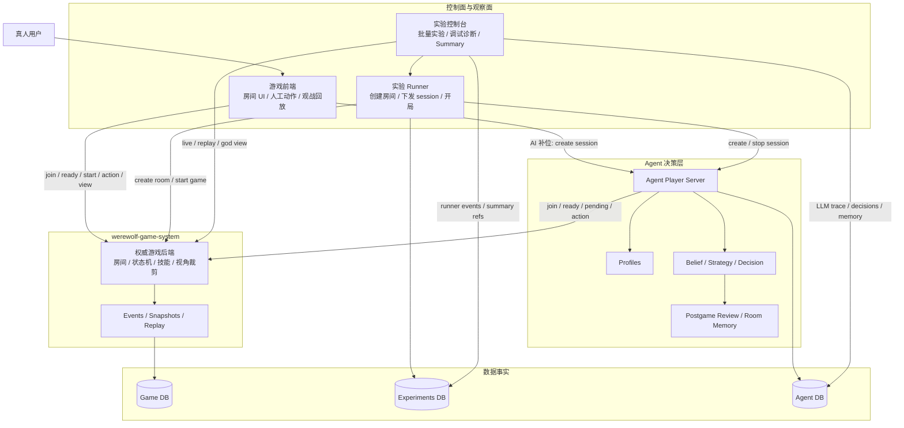

# 架构说明

Werewolf-AI 采用“权威对局内核 + 多控制面 + 外部决策服务”的架构。游戏后端只负责房间和对局事实；真人、脚本、LLM Agent 和实验 runner 都通过公开协议接入，不在游戏规则层区分控制器类型。

这个拆法的核心收益是：同一个狼人杀引擎既能支撑人工体验，也能支撑批量 Agent 实验；上层入口可以按照产品体验或实验效率各自演进，而不把规则、视角隔离、Agent prompt 和实验统计揉在一个系统里。

## 1. 总览



## 2. 核心抽象

### 2.1 游戏系统只认识玩家和动作

游戏系统的权威对象是 `room`、`game`、`player`、`ActionContext` 和 `ActionSubmit`。它不关心某个玩家背后是真人、浏览器脚本、Agent Player Server，还是实验 runner 创建出来的 session。

这种同构接入体现在三条路径上：

- 真人用户通过游戏前端加入房间、ready、查看自己的 pending action，并提交动作。
- AI 补位由游戏前端创建 Agent session；随后 Agent 自己加入房间、ready、轮询 pending action 并提交动作。
- 批量实验由实验 runner 创建房间、创建 Agent session、等待 ready 并开局；局内动作仍由 Agent 直接提交给游戏系统。

因此，游戏系统的职责可以保持稳定：它只维护“这局游戏发生了什么”，不维护“为什么某个控制器这样决策”。

### 2.2 游戏前端和实验控制台是两类控制面

游戏前端和实验控制台地位相近，都是游戏系统之上的控制与观察入口，差异在目标用户和工作流：

| 控制面 | 面向目标 | 主要能力 | 不负责 |
| --- | --- | --- | --- |
| 游戏前端 | 真人游玩、手动调试、演示体验 | 登录昵称、创建/加入房间、准备、AI 补位、真人行动、观战、回放 | 批量实验统计、跨房间调度、Agent 内部推理 |
| 实验控制台 | Agent 对照实验、批量迭代、错误诊断 | 多房间并行、多局串行、固定角色、公开名重排、runner events、summary、LLM trace、live/replay 入口 | 狼人杀规则、局内动作代理、Agent prompt 解析 |

二者都不拥有局内权威状态。需要房间、对局、事件、视角或 replay 时，它们回到游戏系统读取；需要 Agent 内部推理和模型调用时，实验控制台回到 Agent 数据库读取。

## 3. 模块边界

### werewolf-game-system

`werewolf-game-system` 包含游戏后端和游戏前端。

游戏后端是局内事实源，负责：

- 房间、成员、席位、ready 和多局生命周期。
- 游戏规则、角色技能、阶段状态机和胜负结算。
- `public`、`player`、`god` 三类视角裁剪。
- pending action、action response、事件流、状态快照和 replay frame。
- PostgreSQL schema `werewolf_app` 中的对局持久化。

游戏前端是面向真人和演示的 UI 交互层，负责：

- 登录昵称、房间大厅、等待室和对局页面。
- 真人玩家行动面板、AI 补位入口、视角切换、观战和回放。
- 通过 WebSocket 获得更新提醒，再通过 REST 拉取权威视图。

### werewolf-agent

Agent 服务是玩家决策层，负责：

- 接收游戏前端或实验 runner 创建的 session。
- 加入游戏房间、设置 ready、轮询 pending action。
- 按 profile 执行 belief、strategy、decision、repair、fallback。
- 提交合法 action 到游戏系统。
- 终局后读取 replay，执行 postgame review。
- 保存 Agent 私有数据库：deduction、decision、strategy memory、postgame review、LLM call trace。

Agent 直接访问游戏系统，不经过实验平台代理局内动作。

### werewolf-experiments

实验平台是批量编排和观测层，负责：

- 保存实验配置、运行状态和跨系统 ID 映射。
- 创建多个游戏房间并控制并发。
- 通知 Agent Player Server 创建 session。
- 等待 Agent 加入并 ready。
- 按实验配置启动多局对局。
- 记录实验房间、实验对局、Agent session 和 runner events。
- 提供实验控制台、错误抽屉、summary、LLM trace 和观战/回放入口。
- PostgreSQL schema `werewolf_experiments` 中的实验持久化。

实验平台不保存完整局内事件、状态快照或 raw model output。需要复盘时，它回到游戏系统 replay 和 Agent 数据库读取事实。

## 4. 典型数据流

### 4.1 真人或手动调试

```text
真人用户
  → 游戏前端创建/加入房间
  → 游戏前端调用 game-system ready/start
  → 游戏前端查询 pending action
  → 真人提交动作
  → game-system 推进状态、落事件、广播更新
  → 游戏前端拉取 view/events/replay
```

### 4.2 游戏前端 AI 补位

```text
游戏前端
  → Agent Player Server /sessions
  → Agent 加入 game-system room 并 ready
  → 游戏前端开局
  → Agent 轮询 game-system pending-actions
  → Agent 提交 actions
  → game-system 维护事实和 replay
```

### 4.3 批量实验

```text
实验控制台
  → experiments /experiments
  → runner 创建 game-system room
  → runner 创建 agent sessions
  → Agent 加入房间并 ready
  → runner start game
  → Agent 直接轮询/提交动作
  → runner 记录实验对局完成
  → summary 读取 game replay + agent trace
```

### 4.4 观战、回放与分析

```text
游戏前端 live/replay
  → game-system /view /events /replay /ws

实验控制台 live/replay
  → game-system /view /events /replay /ws
  → experiments runner events
  → agent llm_calls / decisions / memories
```

## 5. 身份与信息隔离

系统区分三种身份：

- `room_user_name`：房间成员名，用于 join、ready 和按玩家轮询 pending action。
- `game_user_name`：本局公开名，出现在游戏状态、事件、发言、投票和 action context 中。
- `agent_identity_id`：Agent 私有稳定身份，用于跨局策略记忆和实验分析，不暴露给游戏系统玩家视角。

实验平台可以通过 `public_name_pool` 每局重排公开名，并通过 `fixed_role` 固定某个 slot 的真实角色。开局时 runner 将它们展开为游戏系统支持的 `player_aliases` 和 alias-keyed `role_overrides`。

信息隔离由游戏系统后端执行。公共视角不会包含角色真相、狼人夜聊、验人结果、女巫药品、私有动作请求或 Agent raw output；玩家视角只包含该玩家可见的信息；上帝视角用于可信调试和实验复盘。

## 6. 数据事实源

推荐 PostgreSQL 布局：

```text
database: werewolf_game
├── schema werewolf_app          # game-system：局内事实
└── schema werewolf_experiments  # experiments：实验编排事实

database: werewolf_agent         # agent：认知、决策、记忆与 LLM trace
```

事实归属：

- 胜负、角色、死亡、事件、动作上下文、动作响应、状态快照和 replay 以 game-system 为准。
- 实验配置、房间/对局映射、runner events 和 summary 引用以 experiments 为准。
- belief、decision、postgame review、strategy memory 和 LLM 调用链路以 agent 为准。

Docker 全栈会自动创建 `werewolf_game` 和 `werewolf_agent`。开发模式可以使用内存/SQLite 快速试用，但自进化与实验复现建议使用 PostgreSQL。

## 7. 部署拓扑

### Docker 全栈

```text
browser
  ├─ :8080 game frontend ───── /api,/ws,/agent ── game backend / agent
  └─ :5174 experiment frontend ── /api ────────── experiment backend
                                ├─ /game-api,/ws ─ game backend
                                └─ LLM trace ───── agent database

experiment backend ── INTERNAL_GAME_BACKEND_URL ── game backend
experiment backend ── agent endpoint ───────────── agent
agent ─────────────── game backend
postgres ──────────── werewolf_game / werewolf_agent
```

### 开发模式

```text
5173 game frontend       → 8000 game backend
5173 game frontend       → 9001 agent
5174 experiment frontend → 8100 experiment backend
5174 experiment frontend → 8000 game backend
8100 experiment backend  → 8000 game backend / 9001 agent
9001 agent               → 8000 game backend
8000 / 8100 / 9001       → PostgreSQL 或本地开发存储
```

## 8. 设计取舍

- 游戏系统保持权威和无模型依赖，所有规则正确性和信息隔离都在后端完成。
- 控制面可以有多个，但都通过同一套公开协议读写房间和对局。
- Agent profile 表达实验变量，不通过长期代码分支表达变体。
- 实验平台只保存调度事实和跨系统引用，不复制局内事实。
- replay、LLM trace 和 runner events 共同构成复盘链路。
- 失败优先降级或恢复，避免单次模型输出错误阻塞整局或整批实验。
